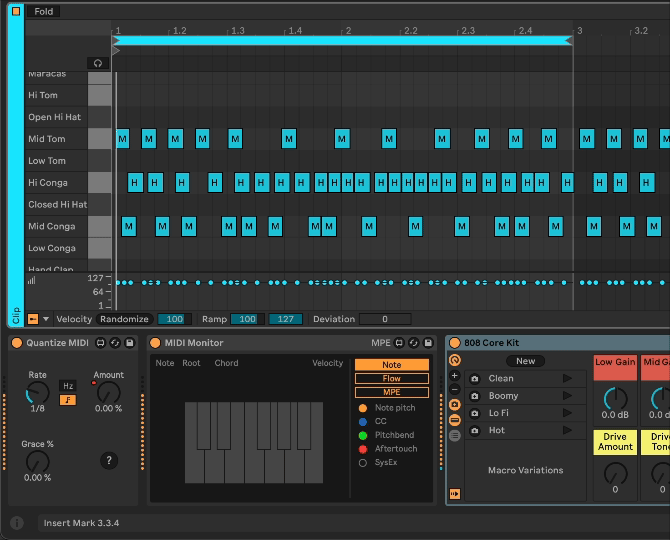

# Quantize MIDI

This plugin allows you to variably quantize MIDI notes in real time.

Because it is dealing with a MIDI data stream and not acting on the notes in a clip, it can only shift notes forward in time.

[YouTube link with audio](https://www.youtube.com/watch?v=qPgCE0wBLYE).

* *Rate* - Controls the quantization interval.
* *Amount* - How much to quantize each note.
* *Grace* - Percent of the Rate interval to not quantize. This can be useful if you want to quantize only notes that are far from the grid.

## Installation

[Download the newest .amxd file from the frozen/ directory](https://github.com/zsteinkamp/m4l-Quantize-MIDI/raw/main/frozen/) or clone this repository, and drag the `Quantize Midi.amxd` device into a track in Ableton Live.

## Changelog

* 2024-08-26 [v1](https://github.com/zsteinkamp/m4l-Quantize-MIDI/raw/main/frozen/Quantize%20Midi%20v1.amxd) - Initial Release

## TODO

* Visualization
* ...

## Contributing

I'd love it if others extended this device. If you would like to contribute, simply fork this repo, make your changes, and open a pull request and I'll have a look.
